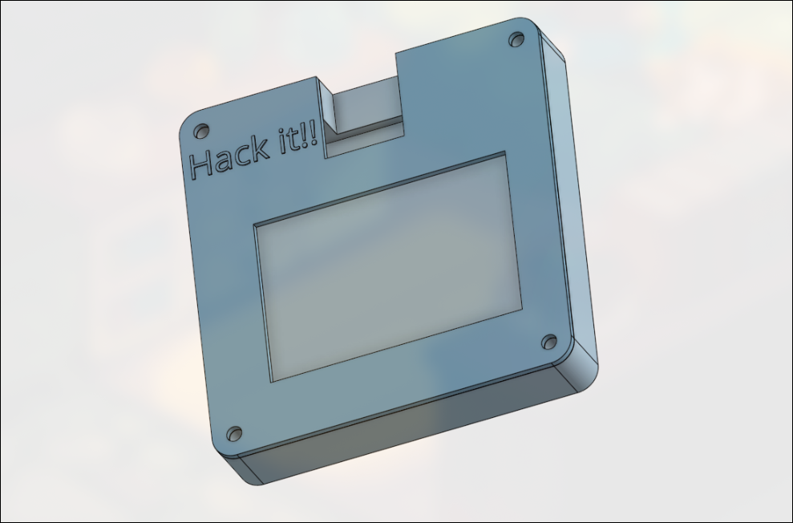
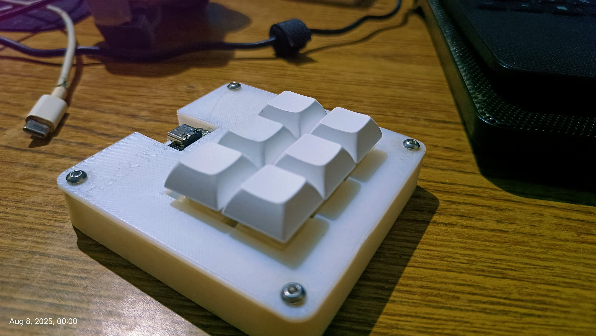
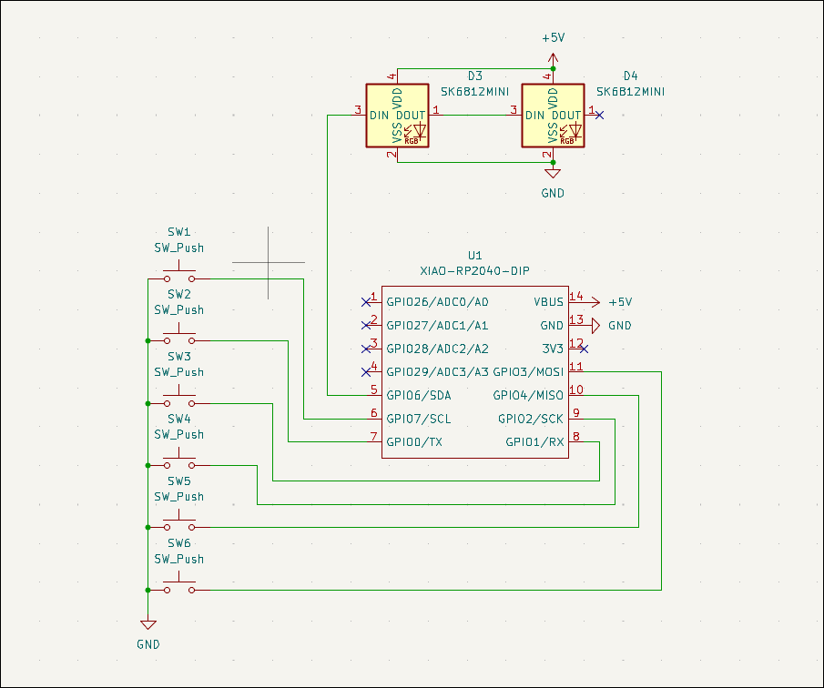
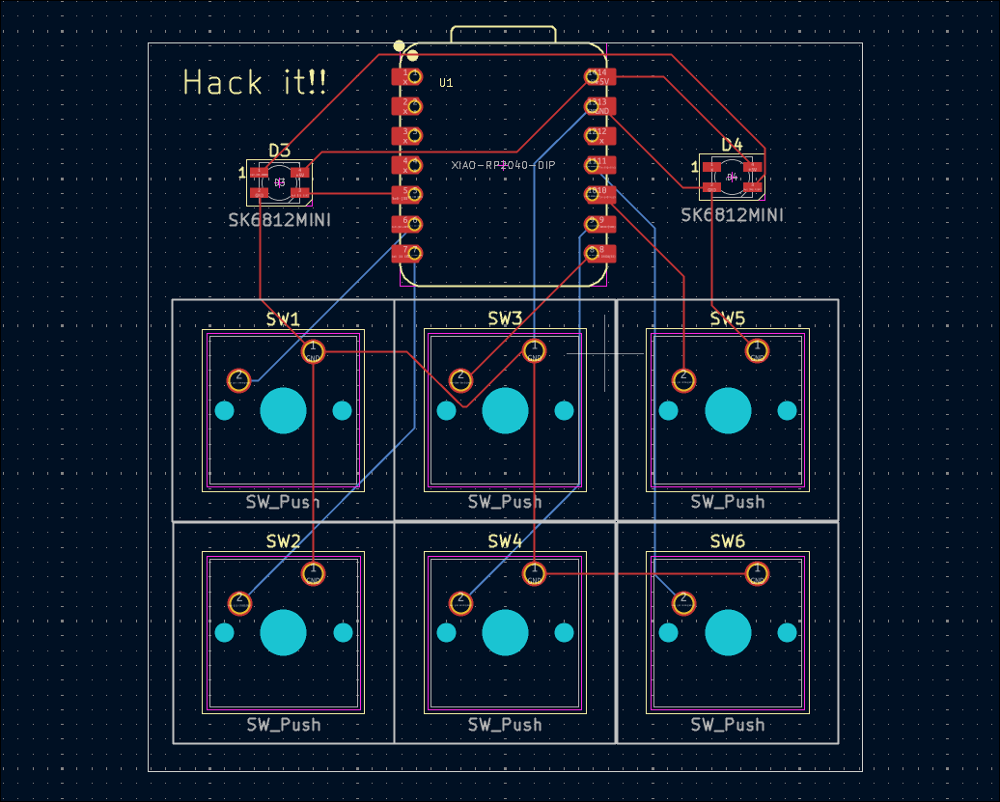
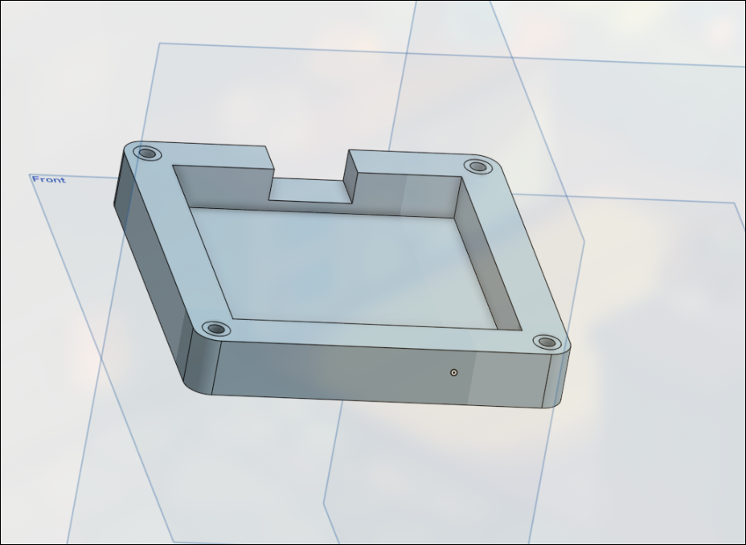
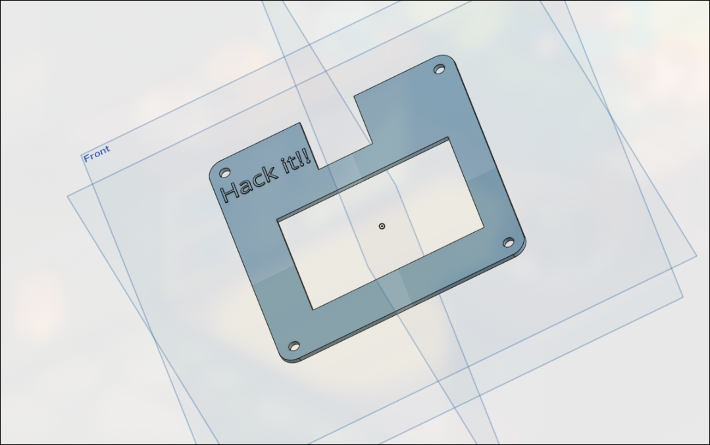
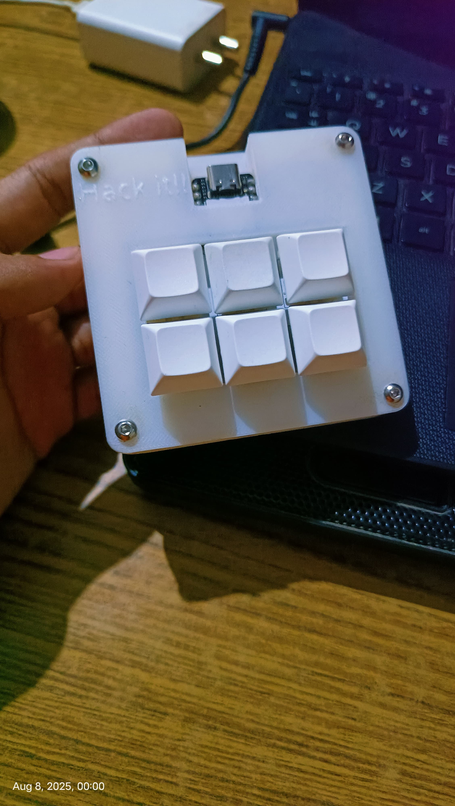
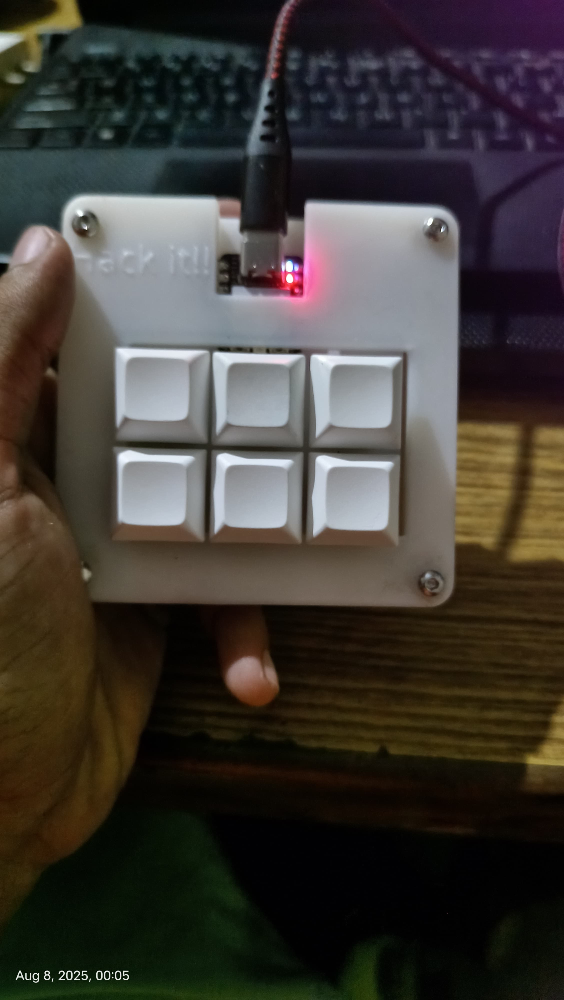
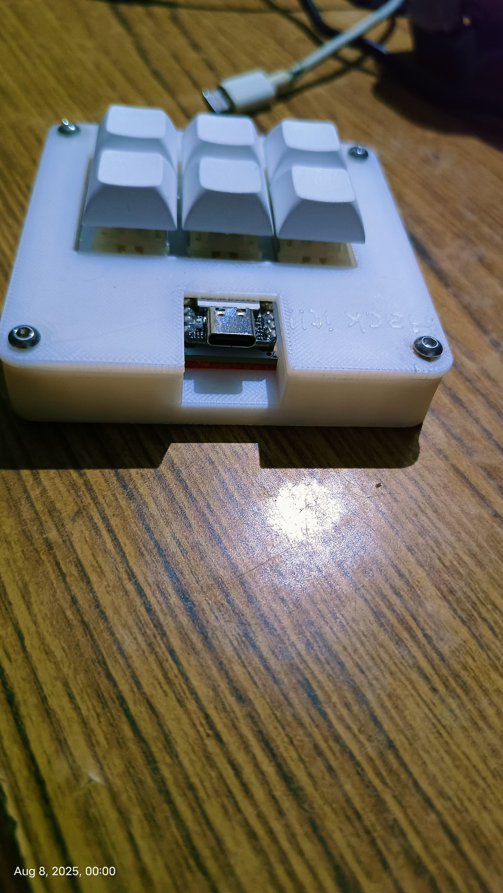

# Hack

### Why did I make it?
As I use hyprland user, I really needed a quick way to switch between windows without having using the keyboard shortcuts So ,I designed the Hackpad(hack)

### What was the hardest part about this ?
I had tons of issues with making the Firmware, as I'm on arch linux too I got too many errors. but at the last I figured out everything.

### Bill of Materials
 - 1x Seeed XIAO RP2040
 - 2x LED_SK6812MINI_PLCC4_3.5x3.5mm_P1.75mm
 - 6x SW_Cherry_MX_1.00u_PCB
 - 6x Blank DSA keycaps (Either White or Red)
 - Case (all black or a mix of Black and White)

### Schematic

---

### PCB 

---

### Case
- Bottom

- Top

-Built project

